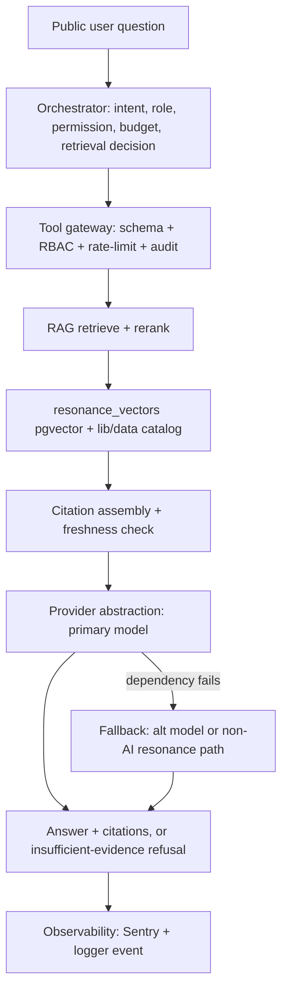
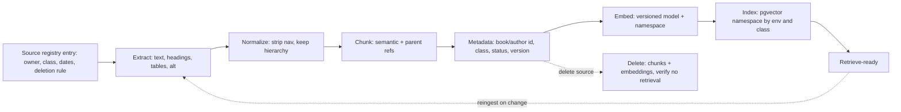

# AI Platform Architecture — Mangu Publishers

> **DRAFT — PROPOSED.** Nothing here is built, ratified, or enabled.
> **Version:** v0.1.0 · **Date:** 2026-07-29 · **Owner:** TBD (proposed: Faith/Renee)
> **Proposed repo path:** `docs/ARCHITECTURE_AI_PLATFORM.md` (PR-A0, delta report §10)
> **Classification:** Documentation-only — permitted under launch freeze #209 **class 1**. This spec **builds nothing**, changes no code, provisions no secrets, enables no flag.
> **Sequencing (every component):** **spec-now → build-Thaw → enable-Post-GO** (delta §8). Each component maps to a delta-report epic: **E06** (AI platform foundation) or **E07** (knowledge/RAG).
> **Sources:** Master Brief §4.3 / §4.4 / §8 / §9; `docs/MASTER_BRIEF_DELTA_REPORT.md` §3 / §6 / §8. Seam paths verified against HEAD `2a525de`.
> **No secrets, tokens, credentials, PII, or manuscript text in this document — ever** (public repo; Brief §0; delta R6).
> **Dovetails with, does not restate:** `AGENT_REGISTRY.md` (who runs), `AI_SAFETY_PRIVACY_POLICY.md` (data rules), `AI_EVALUATION_PLAN.md` (release gates), `COMMAND_CENTER_SPEC.md` (observation deck).

---

## 1. Governing constraint (delta C1 — non-negotiable)

**No AI component may depend on the Phoenix cutover.** Every component targets the dual-run read layer `lib/data/*` and the config-selected provider switches (`lib/db/provider.ts` `getDatabaseProvider()`, `lib/auth/provider.ts` `getAuthProvider()`; both default `supabase` today). No feature may require Better Auth or Mongo primacy. **Model selection is configuration, not business logic** (Brief §4.3). Every component ships **flag-off by default and fail-closed** — on model, vector-store, content-API, or tool failure it degrades to the existing non-AI path and **never fabricates** (Brief §4.3 fallbacks). Today only the `openai` SDK is present (embeddings); nothing generates chat/completions repo-wide (delta §3).

---

## 2. Component architecture

All module paths under `lib/ai/*` are **PROPOSED** (do not exist at HEAD). Status of every row: **PROPOSED**.

| Component | Epic | Purpose (Brief §4.3) | Proposed path | Reuses existing seam | Fail-closed behavior |
|---|---|---|---|---|---|
| Provider abstraction | E06 | One interface, one primary + ≥1 fallback model; selection = config | `lib/ai/provider/` | Pattern of `lib/db/provider.ts` + `lib/auth/provider.ts` (env-selected switch); `lib/resonance/embeddings.ts` (only `openai` SDK today) | Missing/erroring provider ⇒ fallback model, then non-AI path; never a fabricated answer |
| Orchestrator | E06 | Classify intent, role, permission; select skills/tools; set token budget; decide retrieval | `lib/ai/orchestrator/` | `lib/auth/provider.ts` session/role + RBAC middleware; `lib/flags.ts` enablement; `lib/rate-limit.ts` budget | Unknown role/over-budget/flag-off ⇒ deny or route to human; default deny |
| Tool gateway | E06 | Schema validation, RBAC, policy, timeout, idempotency, retries, audit, confirmation (Brief §8) | `lib/ai/gateway/` | **Extends `lib/mcp/guard.ts` + `app/api/mcp/[transport]/route.ts`** `server.tool()` registration; `lib/audit.ts` `recordAudit()`; `lib/rate-limit.ts` | Gate→limit→auth order (guard.ts); 404/401/429 fail-closed; allowlist deny-by-default |
| RAG pipeline | E07 | Ingest→normalize→chunk→metadata→embed→index→retrieve→rerank→cite→freshness (Brief §9) | `lib/ai/rag/` | `lib/resonance/embeddings.ts`; `resonance_vectors` + `match_resonance_vector` RPC; `lib/data/*` content | Retrieval failure ⇒ "insufficient evidence", no answer; never invent citations |
| Knowledge-source registry | E07 | Every source: owner, class, audience, effective/review date, ingest status, allowed answer types | `docs/KNOWLEDGE_SOURCE_REGISTRY.md` + `lib/ai/rag/sources.ts` | Classification model in `AI_SAFETY_PRIVACY_POLICY.md` §2 | Unclassified source ⇒ **Restricted** default; not ingested |
| Conversation store | E06 | Retain per policy; **separate user-visible history from internal traces**; support delete/export | `lib/ai/conversation/` + proposed migration (not created) | **None exists — clean start** (delta §3, §7); RBAC data-class rules | On store failure ⇒ stateless degrade; no silent persistence of Restricted data |
| Prompt registry | E06 | Versioned system/skill/tool/refusal/escalation prompts; none scattered in components | `lib/ai/prompts/` | New; version-pin pattern like NEXT_GO evidence SHAs | Unpinned/unknown prompt version ⇒ refuse to serve that surface |
| Evaluation harness | E06 | Golden/refusal/adversarial/tool/role suites + release gating | `tests/ai-eval/` — **see `AI_EVALUATION_PLAN.md`** (do not restate) | Existing Jest `testMatch`; MCP tools as first tool-use fixtures | Below-threshold suite ⇒ surface stays flag-off; A38 cannot waive |
| Observability | E06 | Per-request telemetry (fields in §6) | Extend `sentry.{client,server,edge}.config.ts` + `lib/logger.ts` | Existing Sentry + structured logger + `lib/audit.ts` | Telemetry write failure ⇒ log-and-continue; never blocks the safety path |
| Fallbacks | E06 | Graceful degradation when model / vector store / content API / tool is down | cross-cutting `lib/ai/*` | **Pattern of `lib/resonance/recommendations.ts`** fault-tolerant chain (try/catch per stage) | Any dependency down ⇒ next tier, then non-AI resonance/catalog path |

---

## 3. Tool gateway (extends the MCP guard seam)

The gateway is the MCP guard generalized from 1 transport to N agent tools. It **reuses**, not reinvents:

- **Guard order** `lib/mcp/guard.ts` `mcpGuard()`: **gate → rate-limit → auth** — limiter runs before auth so credential brute-force is capped (404 disabled/misconfigured, 429 limited, 401 bad bearer). Constant-time key check (`isValidMcpApiKey`, SHA-256 + `timingSafeEqual`).
- **Input sanitation** `sanitizeSearchQuery()` — strips PostgREST filter grammar, caps length. Required at **every** tool boundary; tool outputs are untrusted input (Brief §8; policy §4).
- **Per-call context** (Brief §8): authenticated principal, role, tenant/scope, request ID, agent ID, skill ID, prompt version, confirmation state.
- **Writes:** idempotency key required; high-risk writes = two-step preview+confirm; destructive = step-up auth. **Allowlists, not denylists** — public agents get public tools only.
- **Every tool:** dry-run mode where feasible, deterministic error taxonomy, documented rollback/compensating action. Metadata logged via `lib/audit.ts` `recordAudit()` (+ `redactAuditMetadata()`); Restricted payloads excluded.

---

## 4. RAG pipeline and v0 retrieval decision

Stages and acceptance evidence carried from Brief §9 (spec target for E07):

| Stage | Required behavior | Acceptance evidence |
|---|---|---|
| Source registration | Owner, audience, class, canonical path, effective/review date, deletion rule | Registry entry + approval |
| Extraction | Parse text, headings, tables, metadata, alt text where allowed | Extraction report |
| Normalization | Strip nav noise, preserve hierarchy, normalize ids/dates | Sample + checksum |
| Chunking | Semantic chunks + parent/section refs; never split policy conditions | Chunk-size dist + retrieval test |
| Metadata | Book/author id, edition, audience, class, status, dates, source version | Schema validation 100% |
| Embedding/indexing | **Versioned** model + index namespace by env **and classification** | Index count + version report |
| Retrieval | **Hybrid** keyword+vector with role/status/locale/freshness filters | Recall benchmark + forbidden-source test |
| Reranking | Rerank top-K; preserve source ids + scores | NDCG / ranking metric |
| Answering | Answer only from sufficient evidence or state uncertainty; attach citations | Grounding + citation eval |
| Freshness | Reingest on change; expire superseded policies/unpublished revisions | Freshness SLA dashboard |
| Deletion | Remove source + derived chunks/embeddings; verify no retrieval | Deletion audit + negative retrieval test |

**RAG v0 decision (spec-now):** first retrieval reuses the existing `resonance_vectors` table (`embedding vector(384)`, `supabase/migrations/20260116000000_initial_schema.sql:119-122`) and the `match_resonance_vector` RPC (`supabase/migrations/20260719014349_resonance_engine_phase2.sql:53`), plus the `lib/data/*` catalog API. **Caveat:** that plane is **book-level, one vector per book** (unique index `idx_resonance_vectors_book_unique`, phase2 `:45`) — not document-chunk-level. Chunk-level ingestion, per-chunk metadata, citations, freshness, and deletion are precisely the **gap E07 closes**; v0 answers catalog/author questions with book-level grounding only.

---

## 5. Data-flow diagrams

**(a) Public catalog Q&A — orchestrator → gateway → retrieval → answer + citations**

**(b) Ingestion pipeline (E07)**

---

## 6. Observability fields (onto Sentry + logger)

Every AI request emits one structured event (Brief §4.3): **request ID · user role · model · prompt version · retrieved document IDs · tools invoked · latency · token counts · cost · safety result · answer rating · escalation outcome.** Sink = `sentry.{client,server,edge}.config.ts` + `lib/logger.ts`; tool decisions also via `lib/audit.ts`. Metadata, not sensitive payloads (Brief §8). These fields feed Command Center panels 7–8 (`COMMAND_CENTER_SPEC.md`) and the metrics in `AI_EVALUATION_PLAN.md` §3 — defined there, not here.

---

## 7. Reuse map — brief requirement → existing seam → gap

| Brief §4.3/§8/§9 requirement | Existing repo seam (verified `2a525de`) | Gap to close |
|---|---|---|
| Provider abstraction (primary+fallback) | `lib/db/provider.ts`, `lib/auth/provider.ts` switch pattern; `lib/resonance/embeddings.ts` (openai) | No chat/completions interface; no fallback provider wired (E06) |
| Tool gateway | `lib/mcp/guard.ts`, `app/api/mcp/[transport]/route.ts` (5 tools), `lib/audit.ts`, `lib/rate-limit.ts` | Generalize to N tools; per-tool RBAC/idempotency/confirmation/dry-run (E06) |
| Kill-switch / budgets | `lib/flags.ts` `FEATURE_*`; `lib/rate-limit.ts` fail-closed limiter | Per-agent flags + token/cost budgets (E06) |
| Vector retrieval | `resonance_vectors vector(384)`; `match_resonance_vector` RPC; `lib/data/*` | Book-level only → chunk-level + hybrid + filters (E07) |
| Embedding | `lib/resonance/embeddings.ts` `text-embedding-3-small`, `dimensions: 384` | Versioned model + namespace by env/class; dims decision §8 (E07) |
| Fallback chain | `lib/resonance/recommendations.ts` (user_vector→similar→trending→editorial, try/catch per stage) | Apply pattern to model/tool/retrieval tiers (E06) |
| Observability | `sentry.*.config.ts`, `lib/logger.ts`, `lib/audit.ts` | Add AI-specific fields §6 (E06) |
| Conversation store | none | Build clean: history vs. traces, delete/export (E06) |
| Prompt registry | none | Versioned store (E06) |
| Knowledge registry + ingestion/citation/freshness/deletion | none (Resonance has no ingestion) | Full pipeline §4 (E07) |
| Eval harness | Jest `testMatch`; MCP tools as fixtures | `tests/ai-eval/` per `AI_EVALUATION_PLAN.md` (E06) |

---

## 8. Open decisions (owner gates — nothing builds past them)

Extends delta §9 / `AI_SAFETY_PRIVACY_POLICY` D-series. All **TBD**.

| # | Decision | Why it matters | Note |
|---|---|---|---|
| D-A | Primary + fallback model providers | Provider abstraction is config-first, but SDKs must be chosen | Only `openai` present today; no Anthropic SDK |
| D-B | **Embedding model version + dimensions** | **Real mismatch:** current path down-projects `text-embedding-3-small` to **384-d** (`dimensions: 384`) to fit `resonance_vectors vector(384)` + the 384-d `match_resonance_vector` RPC. Native model output is **1536-d**. Chunk-level RAG (E07) must choose: keep 384-d (reuse index/RPC, cheaper, lower fidelity) **or** move to 1536-d (higher retrieval fidelity, but new column type, new index namespace, new RPC signature, full re-embed) | Blocks E07 index design |
| D-C | Vector-store target post-cutover | v0 = Supabase pgvector; Phoenix cutover may move the plane. Must stay behind `lib/data/*` so AI is unaffected (C1) | No feature may require cutover |
| D-D | Conversation store technology | Clean start; must honor dual-run + retention/delete/export policy | Supabase vs. Mongo vs. dedicated — provider-agnostic |
| D-E | Assistant in launch scope vs. post-GO (delta C6) | Determines when E08–E09 build; requires change-control + NEXT_GO update if pulled forward | Default: post-GO |

---

## 9. Security

This spec does **not** restate policy. All data-class rules, hard prohibitions, prompt-injection defenses, retention, and incident handling live in **`AI_SAFETY_PRIVACY_POLICY.md`** (Brief §4.4 classes; §0 prohibitions). Architectural obligations enforced here: fail-closed at every seam (§1), untrusted-input treatment of retrieval + tool output (§3), allowlist deny-by-default tooling (§3), and no Restricted-class data in prompts, logs, traces, or this repo (public).

---

## 10. Verification

Every path cited above was confirmed to exist at HEAD `2a525de` via read-only inspection: `lib/mcp/guard.ts`, `app/api/mcp/[transport]/route.ts`, `lib/resonance/{embeddings,recommendations}.ts`, `supabase/migrations/{20260116000000_initial_schema,20260719014349_resonance_engine_phase2}.sql`, `lib/data/*` (13 files), `lib/db/provider.ts`, `lib/auth/provider.ts`, `lib/rate-limit.ts`, `lib/flags.ts`, `lib/audit.ts`, `sentry.{client,server,edge}.config.ts`. All `lib/ai/*`, `tests/ai-eval/`, and proposed migrations are **PROPOSED** and absent today. No code, config, secret, or deploy was touched. Rollback = revert the docs commit.
