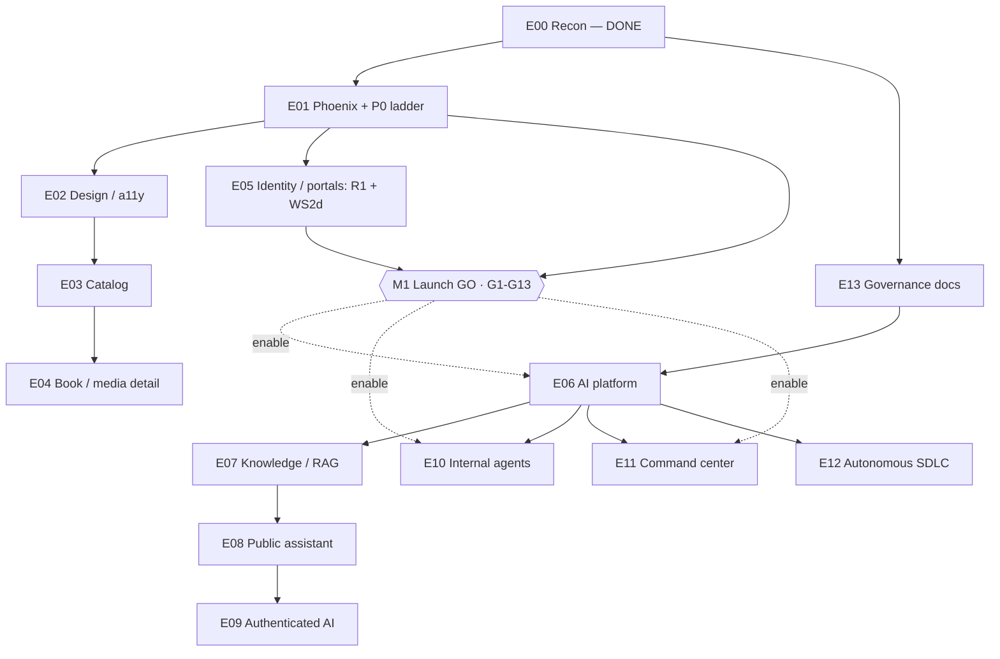

# Master Implementation Plan — Mangu Publishers

> **DRAFT — PROPOSED · v0.1.0 · 2026-07-29 · owner: TBD**
> **Proposed repo path:** `docs/MASTER_IMPLEMENTATION_PLAN.md`
> **Classification:** Documentation-only (permitted under launch freeze **#209 class 1**). No code, config, secret, or deploy touched.
> **Authority:** This plan **schedules** work; it does **not** authorize any merge beyond permitted freeze classes. It is **subordinate to** `docs/NEXT_GO.md` (launch authority, currently **NO-GO**) and `docs/PROJECT_PHOENIX.md` (migration contract, IN PROGRESS). Canonical order: PROJECT_PHOENIX → NEXT_GO → CLAUDE.md → HUMAN_TASKS → Master Brief.
> **Prerequisites, not assumptions:** the delta report §6 conflict amendments **C1–C9** and §9 owner decisions (see Human-Gate Register) must be ratified before the tasks they gate proceed. Where a repo fact is not yet verified, rows are marked **PROPOSED**.
> **Backbone:** operationalizes `docs/MASTER_BRIEF_DELTA_REPORT.md` §8 (epics), §9 (gates), §10 (PR plan). Sibling specs referenced, not restated: `docs/AGENT_REGISTRY.md`, `docs/AI_SAFETY_PRIVACY_POLICY.md`, `docs/AI_EVALUATION_PLAN.md`, `docs/COMMAND_CENTER_SPEC.md`, `docs/QA_MASTER_MATRIX.md`, `docs/ARCHITECTURE_AI_PLATFORM.md`.

## 1. How to read this plan

Task IDs are `T-<epic>.<n>` and cross-reference delta epics **E00–E13**. **Phase** = freeze window: **Now** (permitted during freeze #209 — docs, truthful-CI, security-class-5, or operator evidence), **Thaw** (after controlled thaw, NEXT_GO Phase 16), **Post-GO** (after gates G1–G13 all TRUE). **Owner** ∈ {TBD, Operator, Agent, Owner}. **Est** ∈ {S,M,L}. Gate column cites the governing NEXT_GO gate (G1–G13) or Human-Gate (HG-*).

## 2. Critical path to launch (M1) — mirrors mangu-launch-exec

The launch chain is **overwhelmingly operator-evidence-bound, not code-bound** (most P0 code is agent-DONE; gates fail on missing human console evidence).

| # | Stage | Task / gate | Governing gate |
|---|---|---|---|
| 1 | merge / main READY | T-01.10 (P0-001 #187) | G1, G2 |
| 2 | config / env integrity | T-01.14 (R2; #195/#203) · HG-E5 | G7 |
| 3 | dual-DB run | Phoenix dual-run landed (#349) + T-01.2 | Phoenix WS2 |
| 4 | schema reconciliation | P0-004 DONE (25/25) — confirm | G7 |
| 5 | webhook fulfillment | T-01.12 (P0-010 #205) | G4, G8 |
| 6 | RBAC | T-05.1 (R1 **verified remediated** — `073ceaf`/#352) + rbac-matrix e2e | G5 |
| 7 | field parity | T-01.2 admin writes (WS2d) | Phoenix WS2 |
| 8 | admin pipeline | T-01.2 / T-01.3 (manuscripts) | Phoenix WS2 |
| 9 | dry run / rollback | Phoenix P11.3 + rehearsal | G11 |
| 10 | QA rows 1–10 | T-01.13 (P0-008 #193) | G3,G4,G5,G10 |
| 11 | content truth | T-03.1 (real covers, 3–6 books) | G6 |
| 12 | governance | E13 docs + NEXT_GO refresh | G12,G13 |
| 13 | launch | T-01.15 deploy → all gates TRUE | G1–G13 |

**AI fork-off:** E06–E13 **runtime** (assistants, agents, command-center integrations, autonomous SDLC) forks off **after M1 (Post-GO)**. Only their **specs/docs and flag-disabled builds** proceed pre-GO (Now/Thaw). No AI feature launches merely because code exists (Brief §19).

## 3. Epic dependency map

## 4. Milestones

| ID | Milestone | Definition of done | Gating |
|---|---|---|---|
| **M0** | Recon done | E00 complete; delta report + governance skeletons merged (#365/#366) | **ACHIEVED 2026-07-29** |
| **M1** | Launch GO | Gates **G1–G13 all TRUE**; NEXT_GO status flips GO; controlled thaw begins | Operator P0 ladder + WS2d parity (HG-13) + R2 env |
| **M2** | AI foundation enabled | E06 + E07 built behind flag, evals green, flag enabled in prod | Post-GO; HG-2, HG-9 |
| **M3** | Internal agents live | E10 runtime on tool gateway; approval queues + audit; A40 governance auditor | Post-GO; HG-6, HG-8 |
| **M4** | Command center v1 | E11 aggregated integrations panel (GitHub/Vercel/Atlas/Sentry/Stripe) | Post-GO; HG-10 (C8 tokens) |

## 5. Task register

| ID | Title | Epic | Deps | Owner | Est | Phase | Risk | Verification / acceptance | Gate |
|---|---|---|---|---|---|---|---|---|---|
| T-00.1 | Delta report (recon, gap matrix, C1–C9) | E00 | — | Agent | L | Now ✓ | Low | Merged #365; evidence classes per row | — |
| T-00.2 | 5 governance skeletons (registry/safety/evals/cmd-ctr/QA) | E00 | T-00.1 | Agent | M | Now ✓ | Low | Merged #366 | — |
| T-00.3 | Apply mechanical amendments C1/C2/C5/C7 + CLAUDE.md router truth-fix | E00 | T-00.1 | Owner | S | Now | Low | Owner ack; docs PR diff | HG (C1–C9) |
| T-01.1 | NEXT_GO §8 amendment: add freeze **class 6** (Phoenix parity) | E01 | T-00.3 | Owner | S | Now | Med — governance | Same-PR NEXT_GO update; owner sign-off | HG-13 |
| T-01.2 | WS2d remainder — admin **writes** (`admin/actions`) | E01 | T-01.1 | Agent | M | Thaw | High — auth/RBAC | `tsc` clean; dual-run unit; audit doc written | Phoenix WS2 |
| T-01.3 | WS2d remainder — manuscripts edit/new | E01 | T-01.1 | Agent | M | Thaw | Med | Dual-run unit; upload path test | Phoenix WS2 |
| T-01.4 | WS2d remainder — partner portal parity | E01 | T-01.1 | Agent | M | Thaw | Med | Role-gating e2e | Phoenix WS2 |
| T-01.5 | WS2d remainder — engagement APIs | E01 | T-01.1 | Agent | S | Thaw | Low | Dual-run unit | Phoenix WS2 |
| T-01.6 | WS3 storage → Vercel Blob + rewrite URLs | E01 | T-01.2 | Agent | L | Thaw | Med — data | Migration report 0 failures; 0 supabase.co/storage hits | Phoenix WS3 |
| T-01.7 | WS4 Supabase-code removal (at cutover) | E01 | T-01.6 | Agent | M | Thaw | High — cutover | `lib/supabase/*` deleted; build green | Phoenix WS4 |
| T-01.8 | WS5 data-reconciliation test suite | E01 | T-01.6 | Agent | M | Thaw | Med | Counts/checksums/sample parity 0 variance | Phoenix WS5 |
| T-01.9 | WS6 hardening (logging/limits/rollback) | E01 | T-01.7 | Agent | M | Thaw | Med | Chaos/resilience checks | Phoenix WS6 |
| T-01.10 | P0-001 recovery vehicle + main/deploy READY (#187) | E01 | — | Operator | M | Now | High | Phase 14 D1/D2 dossier | G1,G2 |
| T-01.11 | P0-009 Phase 7A auth evidence (#191) | E01 | — | Operator | M | Now | High — auth | Signed auth package (register/PKCE/login/reset) | G3 |
| T-01.12 | P0-010 Stripe → webhook → order → library (#205) | E01 | — | Operator | M | Now | High — commerce | Signed event 2xx + DB rows + entitlement; one live endpoint (R5) | G4,G8 |
| T-01.13 | P0-008 manual QA rows 1–10 (#193) | E01 | T-01.11,T-01.12 | Operator | M | Now | High | `OPERATOR_QA_LOG.md` rows w/ SHA + artifacts | G3,G4,G5,G10 |
| T-01.14 | P0-011/016 prod Upstash + payment-secret audit / R2 (#195/#203) | E01 | — | Operator | S | Now | High — env | `/api/health?ready=1` → ready:true; secrets validated | G7,G8 |
| T-01.15 | P0-018 deploy via canonical path; D1–D8 (#198) | E01 | T-01.10..14 | Operator | M | Now | High | Deploy dossier + rollback rehearsal | G1,G2,G7,G11 |
| T-02.1 | A11Y-020 checkout `<h1>` fix | E02 | — | Agent | S | Now | Low | e2e accessibility spec green | G6 |
| T-02.2 | A11Y-004/006 heading-level fixes | E02 | — | Agent | S | Now | Low | axe/e2e pass | — |
| T-02.3 | Remove 26 blanket `eslint-disable` (jsx-a11y) | E02 | — | Agent | S | Now | Low | Lint green w/o suppressions | — |
| T-02.4 | Empty/error/loading-state audit vs PRODUCT_GAP_LEDGER | E02 | T-01.9 | Agent | M | Thaw | Low | Gap ledger closed | — |
| T-03.1 | Catalog content-truth: real covers/books (launch scope 3–6) | E03 | M1 prep | Owner | M | Thaw | Med | No dev placeholders in prod | G6 |
| T-03.2 | Comics real panel/issue model (spec Now) | E03 | T-01.9 | Agent | L | Thaw | Med | Data model beyond `books`; reader flow QA | — |
| T-04.1 | Book detail preview/excerpt surface + policy | E04 | HG (C3) | Agent | M | Thaw | Med | Copyright-safe excerpt; entitlement enforced | HG-11 |
| T-05.1 | **R1 role-cookie — VERIFIED already remediated** (`073ceaf`/#352): middleware never trusts `mangu-role`; role enforced server-side in layouts; unit+e2e prove forged cookie grants nothing. Optional only: delete the vestigial `httpOnly` cookie writer or mirror the signed-in forged-cookie case in e2e | E05 | — | Agent | S | Now | Low (was High) | Audit verdict recorded; residual = cleanup, not a security fix | G5 |
| T-05.2 | Partner-portal parity (WS2d; see T-01.4) | E05 | T-01.4 | Agent | S | Thaw | Med | Role-scoped audit | Phoenix WS2 |
| T-06.1 | `ARCHITECTURE_AI_PLATFORM.md` spec (diagrams/data flows) | E06 | T-00.2 | Agent | M | Now | Low | Spec-only PR (PR-A0); no runtime | HG-2 |
| T-06.2 | Provider abstraction (1 primary + ≥1 fallback) | E06 | T-06.1 | Agent | M | Thaw | Med | Model selection = config; fallback test | HG-2 |
| T-06.3 | Orchestrator (intent/role/permission/budget/retrieval) | E06 | T-06.2 | Agent | L | Thaw | High | Zero permission bypass; policy tests | HG-6 |
| T-06.4 | Prompt registry (versioned prompts/refusals) | E06 | T-06.1 | Agent | M | Thaw | Low | Versioned; no scattered prompts | — |
| T-06.5 | Tool gateway (extend fail-closed MCP guard) | E06 | T-06.2 | Agent | L | Thaw | High | Allowlist, RBAC, idempotency, audit; untrusted-output sanitized | HG-6 |
| T-06.6 | Conversation store (retention/delete/export) | E06 | HG-4 | Agent | M | Thaw | Med — privacy | Separate traces; deletion test | HG-4 |
| T-06.7 | Budgets + kill-switch + observability wiring | E06 | T-06.3 | Agent | M | Thaw | Med | Token/cost fields in Sentry+logger; flag kill | — |
| T-06.8 | **Enable** AI foundation (flag on in prod) | E06 | M1,T-06.7 | Owner | S | Post-GO | High | Evals green; owner approval | HG-9 |
| T-07.1 | `KNOWLEDGE_SOURCE_REGISTRY.md` + approved source list | E07 | HG-8 | Agent | M | Now | Med | Registry entry + approval record per source | HG-8 |
| T-07.2 | Ingestion / chunking / metadata enrichment | E07 | T-06.5,T-07.1 | Agent | L | Thaw | Med | Extraction report; schema valid 100% | HG-3 |
| T-07.3 | Retrieval v0 (reuse Resonance vectors + catalog API) | E07 | T-07.2 | Agent | M | Thaw | Med | Recall benchmark; forbidden-source test | — |
| T-07.4 | Citation assembly + answer-grounding check | E07 | T-07.3 | Agent | M | Thaw | High | Grounding + citation eval | — |
| T-07.5 | Freshness + deletion enforcement | E07 | T-07.2 | Agent | M | Thaw | Med | Freshness SLA; negative-retrieval test | — |
| T-07.6 | **Enable** RAG (flag on) | E07 | M1,T-07.4 | Owner | S | Post-GO | Med | Eval gate passed | HG-9 |
| T-08.1 | Public catalog assistant UX + skills (Brief §4.2) | E08 | T-06.8,T-07.6 | Agent | L | Post-GO | High | Citation precision ≥98%; entry points + copy/feedback/sources | HG-1,HG-9 |
| T-08.2 | Safety / refusal / escalation skills | E08 | T-08.1 | Agent | M | Post-GO | High | 100% high-severity escalation in test set | — |
| T-08.3 | Eval harness release gate (golden/red-team) | E08 | T-08.1 | Agent | M | Post-GO | Med | Regression thresholds enforced; cannot waive | — |
| T-09.1 | Reader concierge tools (library/order/progress) | E09 | T-08.1,HG-7 | Agent | L | Post-GO | High | Owner-only; no cross-user leakage; confirm before write | HG-7 |
| T-09.2 | Author assistant (metadata drafts, confirmations) | E09 | T-08.1 | Agent | M | Post-GO | Med | Draft-only; publish requires confirmation | HG-1 |
| T-09.3 | Personal-data controls (disable personalization / clear prefs) | E09 | T-09.1 | Agent | S | Post-GO | Med | Controls visible; reset works | HG-5 |
| T-10.1 | AGENT_REGISTRY expand — A29–A40 ops roles (map 23 packs) | E10 | T-00.2 | Agent | M | Now | Low | Each: permissions/tools/prompt/owner/kill-switch | HG-8 |
| T-10.2 | AGENT_REGISTRY expand — A09–A28 editorial/marketing | E10 | T-10.1 | Agent | M | Now | Low | Registry rows complete | — |
| T-10.3 | Agent runtime on tool gateway | E10 | T-06.5,HG-6 | Agent | L | Post-GO | High | Bounded perms; audit logs; no blanket access | HG-6 |
| T-10.4 | Approval queues + A40 governance auditor | E10 | T-10.3 | Agent | M | Post-GO | Med | Quarterly cert; zero orphan access | — |
| T-11.1 | `COMMAND_CENTER_SPEC` + dashboard schema (skeleton done #366) | E11 | T-00.2 | Agent | M | Now | Low | Panels + R/A/G rules + schema defined | — |
| T-11.2 | v0: reuse `/admin/health` + `/admin/dashboard` + `/api/health` | E11 | T-11.1 | Agent | M | Thaw | Low | Read-only status view | — |
| T-11.3 | v1: aggregate integrations panel (after tokens) | E11 | M1,HG-10 | Agent | L | Post-GO | Med — secrets | Status freshness + alert accuracy | HG-10 |
| T-11.4 | v2: AI-quality + approvals + cost panels | E11 | T-11.3,T-06.8 | Agent | M | Post-GO | Med | AI health + pending-approval queue live | — |
| T-12.1 | Normalize incident events → Sentry/health → issue creation | E12 | HG-12 | Agent | M | Thaw | Med | Deduped fingerprint events → tickets | HG-12 |
| T-12.2 | Dedupe/fingerprint + RCA correlation chain | E12 | T-12.1 | Agent | M | Thaw | Med | RCA evidence links; confidence labels | — |
| T-12.3 | Steward-verified agent PRs — **human merge gate** | E12 | T-12.2,HG-6 | Agent | M | Thaw | High | No autonomous prod merge (Brief §0); CI green + rollback | HG-6,HG-12 |
| T-13.1 | `SKILL_REGISTRY.md` (spec template §7) | E13 | T-00.2 | Agent | M | Now | Low | Every skill: schema/perms/tests/acceptance | — |
| T-13.2 | `AI_INCIDENT_RESPONSE.md` | E13 | T-00.2 | Agent | S | Now | Low | Detection→escalation→postmortem paths | — |
| T-13.3 | Feature-flag plan + env-var schema (Brief §19) | E13 | T-00.2 | Agent | S | Now | Low | Flag inventory + env matrix; no secrets | — |

## 6. Human-Gate Register (delta §9 decisions + open HUMAN_TASKS)

Nothing downstream proceeds past an OPEN gate. Owner = Faith/Renee unless noted.

| Gate | Decision / action | Owner | Blocks | Source | Status |
|---|---|---|---|---|---|
| HG-1 | AI assistant name / brand voice | Owner | T-08.1, T-09.2 | §9.1 / App.B | OPEN |
| HG-2 | Primary + fallback model providers | Owner | T-06.2, T-06.8 | §9.2 | OPEN (only `openai` SDK present) |
| HG-3 | Unpublished-manuscript use in AI | Owner | T-07.2 | §9.3 | OPEN — rec **NO** (opt-in, staff-scoped) |
| HG-4 | Conversation retention policy | Owner | T-06.6 | §9.4 | OPEN — rec minimal + user-delete |
| HG-5 | Personalization boundaries | Owner | T-09.3 | §9.5 | OPEN — explicit controls, no sensitive inference |
| HG-6 | Agent autonomy ceiling | Owner | T-06.3, T-10.3, T-12.3 | §9.6 | OPEN — rec draft+verify, human merge |
| HG-7 | Refund / account actions | Owner | T-09.1 | §9.7 | OPEN — route to human |
| HG-8 | Internal knowledge sources (register+classify) | Owner | T-07.1, T-10.1 | §9.8 | OPEN |
| HG-9 | (C6) AI assistant in launch scope vs Post-GO | Owner | T-06.8, T-07.6, T-08.1 | §9.9 / C6 | OPEN — rec **Post-GO** (needs change-control + NEXT_GO update) |
| HG-10 | (C8) Provision read-only tokens (GitHub/Vercel/Atlas/Sentry/Stripe) | Owner/Operator | T-11.3 | §9.10 / C8 | OPEN — per-integration approval; no new secrets to agents |
| HG-11 | (C3) Cart: adopt or formally defer (buy-now model) | Owner | T-04.1, commerce | §9.11 / C3 | OPEN — undecided in any repo doc |
| HG-12 | (C4) Ratify or **retire** H0.2b auto-merge-on-green | Owner | T-12.1, T-12.3 | §9.12 / C4 | OPEN — rec **retire** (conflicts Brief §0) |
| HG-13 | (C9) NEXT_GO freeze **class 6** = Phoenix parity | Owner | T-01.1..T-01.9, T-05.2 | §9.13 / C9 | OPEN — until ratified, WS2d-remainder merges are out of scope |
| HG-E1 | C0.1 Disable Cursor storm automations | Operator | T-12.1 | HUMAN_TASKS C0.1 | OPEN (verified still required) |
| HG-E2 | C0.0 Confirm/tick WS2d #349 merged | Operator | T-01.2 | HUMAN_TASKS C0.0 | LIKELY DONE — confirm (PR closed) |
| HG-E3 | H0.1 Migrate off exposed legacy Supabase anon key | Operator | security ladder | HUMAN_TASKS H0.1 | OPEN |
| HG-E4 | H0.3 / H0.4 console + deploy hardening | Operator | T-01.15 | HUMAN_TASKS H0.3/H0.4 | OPEN |
| HG-E5 | H1.3 Vercel env audit (feeds R2) | Operator | T-01.14 | HUMAN_TASKS H1.3 | OPEN — likely explains blank-body PDP/API symptoms (#350) |
| HG-E6 | H1.4 Enable leaked-password protection | Operator | T-01.11 | HUMAN_TASKS H1.4 | OPEN |
| HG-E7 | **P0 operator evidence ladder** (auth 7A + Stripe + QA rows) | Operator | T-01.11/12/13/15 → M1 | NEXT_GO §5 | OPEN — **the launch bottleneck** |

## 7. Deliverables checklist — Brief §19 doc set

| # | Deliverable | Task | Status |
|---|---|---|---|
| 1 | `MASTER_IMPLEMENTATION_PLAN.md` | this doc | **DRAFT — PROPOSED** |
| 2 | `ARCHITECTURE_AI_PLATFORM.md` | T-06.1 | **DONE** skeleton (PR-A0, this branch) |
| 3 | `AGENT_REGISTRY.md` | T-10.1/2 | **DONE** skeleton (#366); expand PROPOSED |
| 4 | `SKILL_REGISTRY.md` | T-13.1 | PROPOSED |
| 5 | `KNOWLEDGE_SOURCE_REGISTRY.md` | T-07.1 | PROPOSED |
| 6 | `AI_SAFETY_PRIVACY_POLICY.md` | — | **DONE** skeleton (#366) |
| 7 | `AI_INCIDENT_RESPONSE.md` | T-13.2 | PROPOSED |
| 8 | `AI_EVALUATION_PLAN.md` | T-08.3 | **DONE** skeleton (#366) |
| 9 | `COMMAND_CENTER_SPEC.md` | T-11.1 | **DONE** skeleton (#366) |
| 10 | `QA_MASTER_MATRIX.md` | — | **DONE** skeleton (#366) |
| 11 | `HUMAN_TASKS.md` | — | EXISTS at repo root (live ledger; per C5 do **not** create a `docs/` duplicate) |
| + | Feature-flag plan + env-var schema | T-13.3 | PROPOSED |
| + | One PR per workstream (tests/rollback/screenshots) | delta §10 | STANDING discipline |

---
*End of DRAFT v0.1.0. Task counts: **Now 22** (incl. 2 complete), **Thaw 27**, **Post-GO 12** (61 total). Supersede only via a versioned PR that refreshes this file and cites owner approval of the gates it depends on.*
